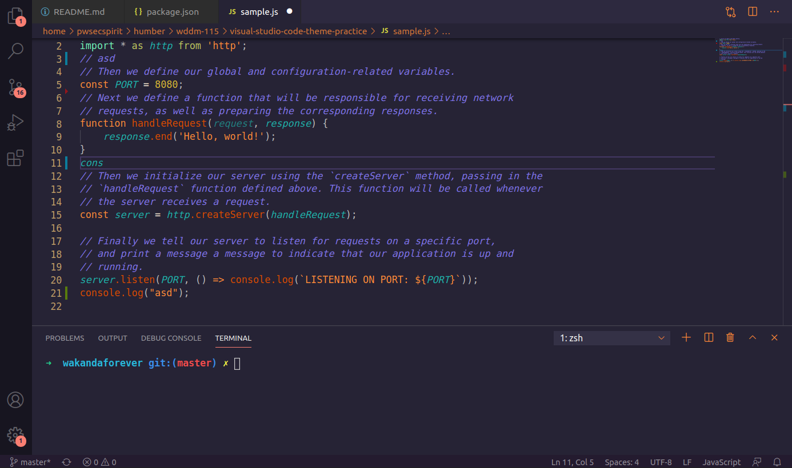
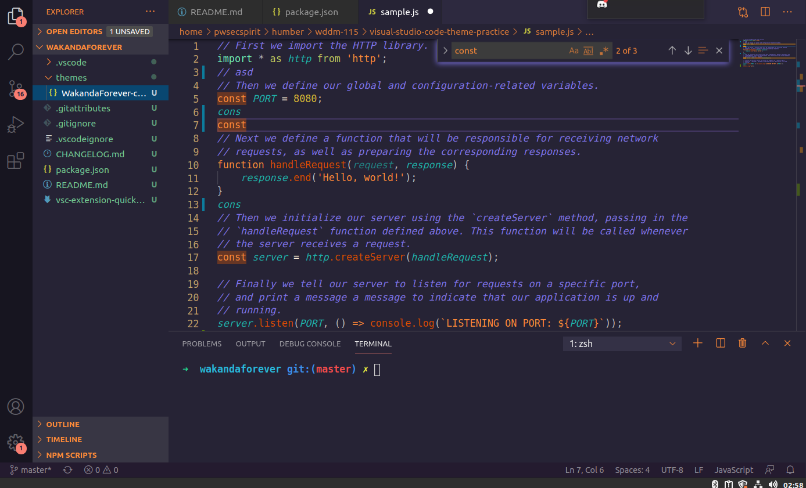
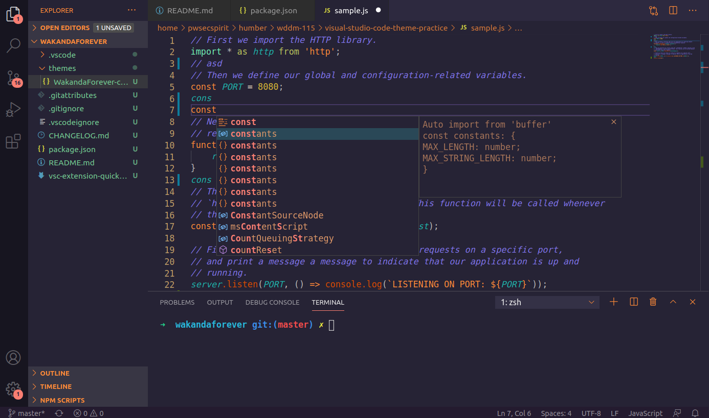

# WakandaForever Theme for VS Code

Hello Avenger Fan, Yes you have come to the right place. Thanks for checking out my VS Code theme. Please show your love by installing the theme and let me know if you like it.

This theme is part of my college exercise for WDDM-115 course.

## Installation

1. Open the extensions sidebar on Visual Studio Code
1. Search for Wakanda Forever Theme
1. Click Install
1. Click Reload to reload your editor
1. Select the Manage at (bottom left) > Color Theme ＞ WakandaForever Theme
1. Please Rate five-stars if you like

## Screenshots

The main view

I have also added the wakanda special shadow effect

The auto-suggestion dropdown is preety dope too now.

## Issues & Suggestions

For any issues or suggestions, please use [GitHub issues](https://github.com/spiritedwolf/WakandaForever-vscode-theme/issues).

## Special Thanks

[VSCode API Reference](https://code.visualstudio.com/api/references/theme-color) 
[Theme Inspiration](https://github.com/robb0wen/synthwave-vscode) 
[Wakanda Forever logo](https://www.pngitem.com/middle/JhRTbb_watchcat-wakanda-wednesday-black-panther-wakanda-forever-png/) 
